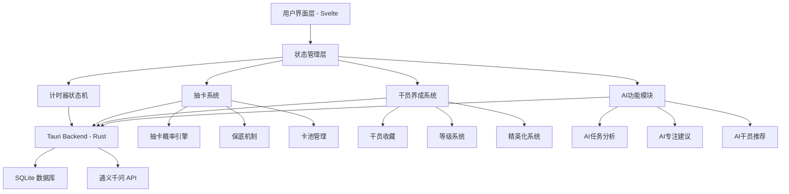
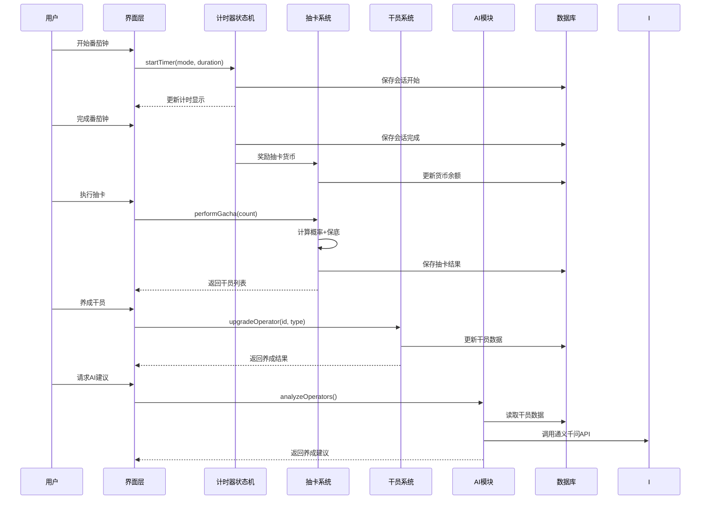

# 设计文档：明日方舟抽卡养成系统

## 概述

本设计文档描述了对现有番茄钟应用的完整重新设计，将"量子仓鼠"宠物系统替换为明日方舟风格的干员抽卡养成系统，并重构番茄钟逻辑以形成完整的奖励闭环。

核心改进包括：

1. **明日方舟干员抽卡系统** - 1:1 复刻明日方舟的抽卡概率和保底机制，干员分为 3★-6★ 稀有度
2. **完整的奖励闭环** - 完成番茄钟 → 获得抽卡货币（源石/合成玉）→ 抽卡获得干员 → 消耗资源养成干员
3. **番茄钟逻辑重构** - 支持倒计时和正向计时两种模式，完善状态管理和奖励机制
4. **挑战系统整合** - 保留反拖延轮盘挑战，完成挑战获得额外奖励
5. **AI 功能增强** - 让 AI 功能更明显实用，支持干员配置分析和养成优先级推荐

本设计保持现有的优雅古典风格，融入明日方舟主题元素。

---

## 架构设计

### 系统架构图



### 主要工作流程



---

## 组件和接口设计

### 1. 计时器状态机 (TimerStateMachine)

**目的**: 管理番茄钟的完整生命周期，支持倒计时和正向计时两种模式

**接口**:
```pascal
STRUCTURE TimerState
  mode: TimerMode              // "work" 或 "break"
  countMode: CountMode         // "countdown" 或 "countup"
  secondsLeft: Integer
  isRunning: Boolean
  startedAt: Timestamp
  challengeId: String
  challengeBroken: Boolean
END STRUCTURE

PROCEDURE startTimer(state, settings)
  INPUT: state (TimerState), settings (AppSettings)
  OUTPUT: updatedState (TimerState)
  
PROCEDURE pauseTimer(state)
  INPUT: state (TimerState)
  OUTPUT: updatedState (TimerState)
  
PROCEDURE resetTimer(state, settings)
  INPUT: state (TimerState), settings (AppSettings)
  OUTPUT: updatedState (TimerState)
  
PROCEDURE finishSession(state, completed)
  INPUT: state (TimerState), completed (Boolean)
  OUTPUT: rewards (SessionRewards)
```

**职责**:
- 管理计时器的启动、暂停、重置、完成
- 根据计时模式（倒计时/正向计时）更新时间
- 跟踪挑战状态
- 计算会话奖励

---

### 2. 抽卡系统 (GachaSystem)

**目的**: 实现明日方舟的抽卡机制，包括概率计算和保底系统

**接口**:
```pascal
STRUCTURE GachaResult
  operators: Array of Operator
  currency: Currency
  pityCounter: Integer
END STRUCTURE

STRUCTURE Operator
  id: String
  name: String
  rarity: Integer              // 3-6 星
  class: OperatorClass         // 先锋、近卫、重装等
  level: Integer
  elite: Integer               // 0, 1, 2
  experience: Integer
  potential: Integer           // 1-6
END STRUCTURE

PROCEDURE performGacha(count, currency)
  INPUT: count (Integer), currency (Currency)
  OUTPUT: result (GachaResult)
  
PROCEDURE calculateRarity(pityCounter)
  INPUT: pityCounter (Integer)
  OUTPUT: rarity (Integer)
  
PROCEDURE updatePityCounter(pityCounter, rarity)
  INPUT: pityCounter (Integer), rarity (Integer)
  OUTPUT: newPityCounter (Integer)
```

**职责**:
- 执行单抽和十连抽
- 根据保底机制计算稀有度
- 管理抽卡历史和保底计数器
- 扣除和返还抽卡货币

---

### 3. 干员养成系统 (OperatorDevelopment)

**目的**: 管理干员的升级、精英化和潜能提升

**接口**:
```pascal
STRUCTURE UpgradeResult
  success: Boolean
  operator: Operator
  costResources: Resources
  message: String
END STRUCTURE

PROCEDURE upgradeOperatorLevel(operatorId, resources)
  INPUT: operatorId (String), resources (Resources)
  OUTPUT: result (UpgradeResult)
  
PROCEDURE eliteOperator(operatorId, eliteLevel, resources)
  INPUT: operatorId (String), eliteLevel (Integer), resources (Resources)
  OUTPUT: result (UpgradeResult)
  
PROCEDURE increasePotential(operatorId)
  INPUT: operatorId (String)
  OUTPUT: result (UpgradeResult)
```

**职责**:
- 干员等级提升
- 精英化（Elite 0 → Elite 1 → Elite 2）
- 潜能提升（获得重复干员时）
- 资源消耗验证

---

### 4. 货币和资源系统 (CurrencySystem)

**目的**: 管理抽卡货币和养成资源

**接口**:
```pascal
STRUCTURE Currency
  originite: Integer           // 源石（付费货币）
  orundum: Integer             // 合成玉（抽卡货币）
  lmd: Integer                 // 龙门币（养成货币）
END STRUCTURE

STRUCTURE Resources
  lmd: Integer
  exp: Integer                 // 经验值道具
  chips: Map<String, Integer>  // 芯片（精英化材料）
END STRUCTURE

PROCEDURE earnCurrency(sessionType, challengeCompleted)
  INPUT: sessionType (String), challengeCompleted (Boolean)
  OUTPUT: earnedCurrency (Currency)
  
PROCEDURE spendCurrency(cost, available)
  INPUT: cost (Currency), available (Currency)
  OUTPUT: success (Boolean), remaining (Currency)
```

**职责**:
- 完成番茄钟后奖励货币
- 抽卡时扣除货币
- 养成时扣除资源
- 货币和资源余额管理

---

### 5. AI 功能模块 (AIModule)

**目的**: 提供智能分析和建议功能

**接口**:
```pascal
PROCEDURE analyzeOperatorTeam(operators)
  INPUT: operators (Array of Operator)
  OUTPUT: analysis (String)
  
PROCEDURE recommendUpgradePriority(operators, resources)
  INPUT: operators (Array of Operator), resources (Resources)
  OUTPUT: recommendations (Array of Recommendation)
  
PROCEDURE generateDailySummary(sessions, todos)
  INPUT: sessions (Array of Session), todos (Array of Todo)
  OUTPUT: summary (String)
```

**职责**:
- 分析干员配置，推荐队伍搭配
- 根据资源情况推荐养成优先级
- 生成每日专注总结
- 分析待办任务优先级

---

## 数据模型

### 干员数据模型 (Operator)

```pascal
STRUCTURE Operator
  id: String                   // 唯一标识
  name: String                 // 干员名称
  rarity: Integer              // 稀有度 3-6
  class: OperatorClass         // 职业
  level: Integer               // 当前等级 1-90
  elite: Integer               // 精英化阶段 0-2
  experience: Integer          // 当前经验值
  potential: Integer           // 潜能 1-6
  obtainedAt: Timestamp        // 获得时间
  lastUpgradedAt: Timestamp    // 最后养成时间
END STRUCTURE

ENUM OperatorClass
  VANGUARD                     // 先锋
  GUARD                        // 近卫
  DEFENDER                     // 重装
  SNIPER                       // 狙击
  CASTER                       // 术师
  MEDIC                        // 医疗
  SUPPORTER                    // 辅助
  SPECIALIST                   // 特种
END ENUM
```

**验证规则**:
- rarity 必须在 3-6 之间
- level 必须在 1-90 之间，且受 elite 等级限制
- elite 必须在 0-2 之间
- potential 必须在 1-6 之间

---

### 抽卡历史模型 (GachaHistory)

```pascal
STRUCTURE GachaHistory
  id: String
  timestamp: Timestamp
  gachaType: String            // "single" 或 "ten"
  operators: Array of Operator
  costCurrency: Currency
  pityCounterBefore: Integer
  pityCounterAfter: Integer
END STRUCTURE
```

**验证规则**:
- gachaType 必须是 "single" 或 "ten"
- operators 数组长度必须匹配 gachaType
- costCurrency 必须正确反映消耗

---

### 会话奖励模型 (SessionRewards)

```pascal
STRUCTURE SessionRewards
  sessionId: String
  sessionType: String          // "work" 或 "break"
  completed: Boolean
  isBoss: Boolean
  challengeCompleted: Boolean
  earnedCurrency: Currency
  earnedResources: Resources
END STRUCTURE
```

---

## 核心算法（伪代码）

### 算法 1: 抽卡概率计算

```pascal
ALGORITHM calculateGachaRarity
INPUT: pityCounter (Integer)
OUTPUT: rarity (Integer)

BEGIN
  // 明日方舟概率：
  // 6星: 2% (基础) + 2% * max(0, pityCounter - 50)
  // 5星: 8%
  // 4星: 50%
  // 3星: 40%
  
  // 计算6星概率（保底机制）
  IF pityCounter >= 50 THEN
    sixStarRate ← 0.02 + 0.02 * (pityCounter - 50)
  ELSE
    sixStarRate ← 0.02
  END IF
  
  // 生成随机数
  random ← RANDOM(0, 1)
  
  // 根据概率区间判断稀有度
  IF random < sixStarRate THEN
    RETURN 6
  ELSE IF random < sixStarRate + 0.08 THEN
    RETURN 5
  ELSE IF random < sixStarRate + 0.08 + 0.50 THEN
    RETURN 4
  ELSE
    RETURN 3
  END IF
END
```

**前置条件**:
- pityCounter >= 0
- pityCounter 表示自上次获得6星以来的抽卡次数

**后置条件**:
- 返回值在 3-6 之间
- 当 pityCounter >= 99 时，必定返回 6（硬保底）

**循环不变式**: N/A（无循环）

---

### 算法 2: 十连抽执行

```pascal
ALGORITHM performTenPull
INPUT: pityCounter (Integer), currency (Currency)
OUTPUT: result (GachaResult)

BEGIN
  ASSERT currency.orundum >= 6000  // 十连需要6000合成玉
  
  operators ← EMPTY_ARRAY
  currentPity ← pityCounter
  hasFiveStar ← FALSE
  
  // 执行10次抽卡
  FOR i FROM 1 TO 10 DO
    ASSERT currentPity >= 0
    
    rarity ← calculateGachaRarity(currentPity)
    operator ← selectRandomOperator(rarity)
    operators.ADD(operator)
    
    // 更新保底计数器
    IF rarity = 6 THEN
      currentPity ← 0
    ELSE
      currentPity ← currentPity + 1
    END IF
    
    IF rarity >= 5 THEN
      hasFiveStar ← TRUE
    END IF
  END FOR
  
  // 十连保底：至少一个5星
  IF NOT hasFiveStar THEN
    // 将最后一个3星或4星替换为5星
    lastIndex ← 9
    operators[lastIndex] ← selectRandomOperator(5)
  END IF
  
  // 扣除货币
  currency.orundum ← currency.orundum - 6000
  
  ASSERT operators.LENGTH = 10
  ASSERT currentPity >= 0
  
  RETURN GachaResult(operators, currency, currentPity)
END
```

**前置条件**:
- currency.orundum >= 6000
- pityCounter >= 0

**后置条件**:
- 返回10个干员
- 至少包含1个5星或6星干员
- currency.orundum 减少6000
- pityCounter 正确更新

**循环不变式**:
- 每次迭代后，operators 数组长度等于当前迭代次数
- currentPity 始终 >= 0

---

### 算法 3: 干员升级

```pascal
ALGORITHM upgradeOperatorLevel
INPUT: operator (Operator), resources (Resources)
OUTPUT: result (UpgradeResult)

BEGIN
  // 检查等级上限
  maxLevel ← getMaxLevel(operator.elite)
  IF operator.level >= maxLevel THEN
    RETURN UpgradeResult(FALSE, operator, NULL, "已达到当前精英化等级上限")
  END IF
  
  // 计算升级所需资源
  requiredLMD ← calculateLevelUpCost(operator.level, operator.rarity)
  requiredEXP ← calculateExpRequired(operator.level, operator.rarity)
  
  // 检查资源是否足够
  IF resources.lmd < requiredLMD OR resources.exp < requiredEXP THEN
    RETURN UpgradeResult(FALSE, operator, NULL, "资源不足")
  END IF
  
  // 执行升级
  operator.level ← operator.level + 1
  operator.experience ← operator.experience + requiredEXP
  operator.lastUpgradedAt ← CURRENT_TIMESTAMP()
  
  // 扣除资源
  resources.lmd ← resources.lmd - requiredLMD
  resources.exp ← resources.exp - requiredEXP
  
  costResources ← Resources(requiredLMD, requiredEXP, EMPTY_MAP)
  
  RETURN UpgradeResult(TRUE, operator, costResources, "升级成功")
END
```

**前置条件**:
- operator 不为空
- operator.level >= 1
- resources 不为空

**后置条件**:
- 如果成功，operator.level 增加1
- 如果成功，resources 减少相应数量
- operator.lastUpgradedAt 更新为当前时间

**循环不变式**: N/A（无循环）

---

### 算法 4: 番茄钟奖励计算

```pascal
ALGORITHM calculateSessionRewards
INPUT: session (FocusSession), challengeCompleted (Boolean)
OUTPUT: rewards (SessionRewards)

BEGIN
  earnedCurrency ← Currency(0, 0, 0)
  earnedResources ← Resources(0, 0, EMPTY_MAP)
  
  // 只有完成的工作会话才有奖励
  IF session.mode = "work" AND session.completed THEN
    // 基础奖励
    IF session.isBoss THEN
      earnedCurrency.orundum ← 200      // Boss番茄奖励更多
      earnedResources.lmd ← 500
      earnedResources.exp ← 100
    ELSE
      earnedCurrency.orundum ← 100      // 普通番茄
      earnedResources.lmd ← 300
      earnedResources.exp ← 50
    END IF
    
    // 挑战完成额外奖励
    IF challengeCompleted THEN
      earnedCurrency.orundum ← earnedCurrency.orundum + 50
      earnedResources.lmd ← earnedResources.lmd + 200
    END IF
  END IF
  
  RETURN SessionRewards(
    session.id,
    session.mode,
    session.completed,
    session.isBoss,
    challengeCompleted,
    earnedCurrency,
    earnedResources
  )
END
```

**前置条件**:
- session 不为空
- session.mode 是 "work" 或 "break"

**后置条件**:
- 如果 session.mode = "break"，奖励为0
- 如果 session.completed = FALSE，奖励为0
- Boss 番茄的奖励 > 普通番茄的奖励

**循环不变式**: N/A（无循环）

---

## 示例用法

### 示例 1: 完整的抽卡流程

```pascal
SEQUENCE
  // 用户完成番茄钟
  session ← FocusSession("work", 25, TRUE, FALSE)
  rewards ← calculateSessionRewards(session, TRUE)
  
  // 更新货币
  currency.orundum ← currency.orundum + rewards.earnedCurrency.orundum
  DISPLAY "获得合成玉: " + rewards.earnedCurrency.orundum
  
  // 执行十连抽
  IF currency.orundum >= 6000 THEN
    result ← performTenPull(pityCounter, currency)
    
    // 显示抽卡结果
    FOR EACH operator IN result.operators DO
      DISPLAY operator.name + " (" + operator.rarity + "星)"
      
      // 保存到收藏
      collection.ADD(operator)
    END FOR
    
    // 更新保底计数器
    pityCounter ← result.pityCounter
    currency ← result.currency
  ELSE
    DISPLAY "合成玉不足，需要 " + (6000 - currency.orundum) + " 合成玉"
  END IF
END SEQUENCE
```

---

### 示例 2: 干员养成流程

```pascal
SEQUENCE
  // 选择要养成的干员
  operator ← collection.FIND_BY_ID("operator_001")
  
  // 检查资源
  IF resources.lmd >= 1000 AND resources.exp >= 200 THEN
    // 升级干员
    result ← upgradeOperatorLevel(operator, resources)
    
    IF result.success THEN
      DISPLAY "升级成功！" + operator.name + " 达到 Lv." + operator.level
      resources ← resources - result.costResources
    ELSE
      DISPLAY "升级失败：" + result.message
    END IF
  ELSE
    DISPLAY "资源不足，继续完成番茄钟获取资源"
  END IF
END SEQUENCE
```

---

### 示例 3: AI 推荐养成优先级

```pascal
SEQUENCE
  // 获取所有干员
  operators ← collection.GET_ALL()
  
  // 请求 AI 分析
  prompt ← "分析以下干员配置，推荐养成优先级：\n"
  FOR EACH op IN operators DO
    prompt ← prompt + op.name + " (Lv." + op.level + ", " + op.rarity + "星)\n"
  END FOR
  
  // 调用 AI API
  recommendations ← AI_API.generate(prompt)
  
  DISPLAY "AI 推荐："
  DISPLAY recommendations
END SEQUENCE
```

---

## 正确性属性

*属性是一个特征或行为，应该在系统的所有有效执行中保持为真——本质上是关于系统应该做什么的正式陈述。属性作为人类可读规范和机器可验证正确性保证之间的桥梁。*

### 属性 1: 抽卡概率正确性

*对于任意* 保底计数器值 pityCounter ∈ [0, 99]，抽卡获得6★干员的概率 P(6★) 应满足：当 pityCounter < 50 时 P(6★) = 2%；当 50 ≤ pityCounter < 99 时 P(6★) = 2% + 2% × (pityCounter - 50)；当 pityCounter = 99 时 P(6★) = 100%

**验证需求**: 需求 2.1, 2.2, 2.3

---

### 属性 2: 十连保底正确性

*对于任意* 十连抽结果，结果必定包含至少一个稀有度 ≥ 5 的干员

**验证需求**: 需求 4.4

---

### 属性 3: 货币守恒性

*对于任意* 操作序列，系统中的总货币量应等于初始货币加上所有奖励货币减去所有消耗货币

**验证需求**: 需求 8.7, 9.5, 9.6

---

### 属性 4: 干员等级约束

*对于任意* 干员，其等级必须满足精英化阶段的约束：Elite 0 时 1 ≤ level ≤ 50，Elite 1 时 1 ≤ level ≤ 70，Elite 2 时 1 ≤ level ≤ 90

**验证需求**: 需求 6.3, 6.4, 6.5

---

### 属性 5: 资源非负性

*对于任意* 时刻，所有货币和资源的数量应始终大于等于 0

**验证需求**: 需求 9.6

---

### 属性 6: 保底计数器更新正确性

*对于任意* 抽卡操作，当获得 6★ 干员时保底计数器应重置为 0，当获得非 6★ 干员时保底计数器应加 1

**验证需求**: 需求 2.7, 2.8

---

### 属性 7: 单抽货币消耗正确性

*对于任意* 单次抽卡操作，如果合成玉 ≥ 600 则应扣除 600 合成玉并执行抽卡，否则应拒绝操作

**验证需求**: 需求 3.1, 3.2

---

### 属性 8: 十连货币消耗正确性

*对于任意* 十连抽操作，如果合成玉 ≥ 6000 则应扣除 6000 合成玉并执行十连抽，否则应拒绝操作

**验证需求**: 需求 4.1, 4.2

---

### 属性 9: 干员升级资源消耗正确性

*对于任意* 干员升级操作，如果资源充足则应扣除所需资源并提升等级，否则应拒绝操作

**验证需求**: 需求 6.1, 6.2

---

### 属性 10: 重复干员潜能提升

*对于任意* 已拥有的干员，当再次获得该干员时应将其潜能加 1（最高至 6）

**验证需求**: 需求 5.4, 5.5

---

### 属性 11: 会话奖励计算正确性

*对于任意* 完成的工作会话，应根据会话类型（普通/Boss）和挑战完成状态计算正确的奖励

**验证需求**: 需求 8.1, 8.3, 8.4, 8.5

---

### 属性 12: 数据持久化一致性

*对于任意* 数据变更操作，变更应立即同步到数据库，确保应用重启后数据一致

**验证需求**: 需求 13.7

---

## 错误处理

### 错误场景 1: 货币不足

**条件**: 用户尝试抽卡但合成玉不足
**响应**: 返回错误信息 "合成玉不足，需要 X 合成玉"
**恢复**: 提示用户完成更多番茄钟获取货币

---

### 错误场景 2: 资源不足

**条件**: 用户尝试升级干员但资源不足
**响应**: 返回错误信息 "资源不足：需要 X 龙门币和 Y 经验"
**恢复**: 显示资源获取途径

---

### 错误场景 3: 等级上限

**条件**: 干员已达到当前精英化等级上限
**响应**: 返回错误信息 "已达到等级上限，请先精英化"
**恢复**: 引导用户进行精英化操作

---

### 错误场景 4: 网络错误（AI 功能）

**条件**: 调用通义千问 API 失败
**响应**: 返回错误信息 "AI 服务暂时不可用"
**恢复**: 使用本地缓存的建议或降级为基础功能

---

### 错误场景 5: 数据损坏

**条件**: 从数据库读取的数据格式错误
**响应**: 记录错误日志，尝试数据修复
**恢复**: 如果无法修复，使用默认值或提示用户导入备份

---

## 测试策略

### 单元测试方法

**测试范围**:
- 抽卡概率计算函数
- 保底机制逻辑
- 货币和资源计算
- 干员升级逻辑
- 奖励计算函数

**关键测试用例**:
1. 测试不同 pityCounter 值下的6星概率
2. 测试十连保底机制（至少一个5星）
3. 测试硬保底（99抽必出6星）
4. 测试货币扣除和返还
5. 测试等级上限约束

---

### 属性测试方法

**测试库**: fast-check (TypeScript)

**属性测试用例**:
1. **十连保底属性**: 任意十连抽结果必定包含至少一个5星或6星
2. **货币守恒属性**: 任意操作序列后，货币总量守恒
3. **等级单调性**: 干员等级只能增加，不能减少
4. **概率分布属性**: 大量抽卡后，各稀有度的分布接近理论概率

---

### 集成测试方法

**测试场景**:
1. 完整的番茄钟 → 获得奖励 → 抽卡 → 养成流程
2. 多次抽卡后保底计数器的正确性
3. AI 功能与数据库的集成
4. 数据导入导出功能

---

## 性能考虑

### 抽卡性能

**需求**: 十连抽应在 100ms 内完成
**优化策略**:
- 预生成干员池，避免每次抽卡时查询数据库
- 使用内存缓存存储干员数据
- 批量插入抽卡历史记录

---

### 数据库查询优化

**需求**: 干员列表查询应在 50ms 内完成
**优化策略**:
- 为 rarity、class、level 字段建立索引
- 使用分页加载，避免一次加载所有干员
- 缓存常用查询结果

---

### UI 渲染性能

**需求**: 干员列表滚动应保持 60fps
**优化策略**:
- 使用虚拟滚动（Virtual Scrolling）
- 懒加载干员图片
- 使用 Web Worker 处理复杂计算

---

## 安全考虑

### 客户端验证

**威胁**: 用户修改本地数据获得无限货币
**缓解策略**:
- 所有关键计算在 Rust 后端执行
- 前端只负责展示，不直接修改数据
- 使用数据完整性校验（哈希）

---

### API 密钥保护

**威胁**: 通义千问 API 密钥泄露
**缓解策略**:
- API 密钥加密存储
- 不在日志中记录 API 密钥
- 提供密钥重置功能

---

### 数据备份安全

**威胁**: 备份文件被恶意修改
**缓解策略**:
- 备份文件包含校验和
- 导入时验证数据格式和完整性
- 提供备份加密选项（可选）

---

## 依赖项

### 前端依赖

- **Svelte 5**: UI 框架
- **TypeScript**: 类型安全
- **Tauri API**: 与后端通信

### 后端依赖

- **Rust**: 后端语言
- **Tauri**: 桌面应用框架
- **rusqlite**: SQLite 数据库
- **reqwest**: HTTP 客户端（调用 AI API）
- **serde**: 序列化/反序列化
- **rand**: 随机数生成（抽卡）

### 外部服务

- **通义千问 API**: AI 功能（可选）

---

## 实现优先级

### P0 (必须实现)

1. 抽卡系统核心逻辑（概率计算、保底机制）
2. 干员数据模型和存储
3. 货币系统和奖励计算
4. 基础 UI（抽卡界面、干员列表）

### P1 (高优先级)

1. 干员养成系统（升级、精英化）
2. 资源系统
3. 抽卡历史记录
4. 番茄钟奖励闭环

### P2 (中优先级)

1. AI 功能集成
2. 干员详情页面
3. 数据导入导出
4. 成就系统调整

### P3 (低优先级)

1. 干员图片/立绘
2. 抽卡动画效果
3. 音效和背景音乐
4. 多语言支持

---

## 迁移策略

### 从现有系统迁移

**步骤**:
1. 保留现有的番茄钟和待办功能
2. 添加新的抽卡和干员系统
3. 将"宠物经验"转换为"合成玉"
4. 将"宠物等级"转换为"干员数量"
5. 提供数据迁移工具

**数据映射**:
- petXp → currency.orundum (1:10 比例)
- petLevel → 初始干员数量（每级给1个3星干员）
- bossPoints → currency.originite

---

## 未来扩展

### 可能的功能扩展

1. **基建系统**: 类似明日方舟的基建，自动产生资源
2. **干员技能系统**: 为干员添加技能，影响番茄钟效率
3. **关卡系统**: 使用干员队伍挑战关卡，获得额外奖励
4. **好友系统**: 与其他用户交换干员或资源
5. **限定卡池**: 定期更新限定干员卡池

---

## 总结

本设计文档详细描述了明日方舟抽卡养成系统的完整架构，包括：

- 完整的抽卡系统，1:1 复刻明日方舟机制
- 干员养成系统，支持升级和精英化
- 货币和资源系统，形成完整的奖励闭环
- AI 功能增强，提供智能建议
- 完善的错误处理和测试策略

该设计保持了现有应用的优雅风格，同时引入了明日方舟的核心玩法，为用户提供更丰富的专注激励机制。
