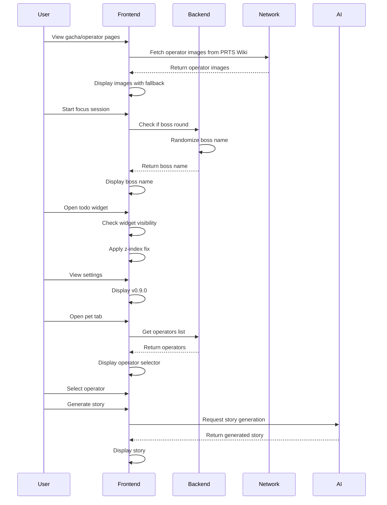

# Design Document: Arknights UI Enhancements

## Overview

This feature enhances the visual appeal and thematic consistency of the Focused Moment application's Arknights gacha system by adding operator images, randomizing boss names, fixing UI issues, and redesigning the cyber pet system to showcase obtained operators with AI-generated descriptions.

## Main Algorithm/Workflow



## Core Interfaces/Types

```typescript
// Operator image handling
interface OperatorImageConfig {
  baseUrl: string;
  fallbackSvg: string;
}

// Boss name system
interface BossConfig {
  names: string[];
  selectionMode: 'random' | 'sequential';
}

// Widget visibility
interface WidgetConfig {
  zIndex: number;
  visible: boolean;
  position: { x: number; y: number };
}

// Pet system redesign
interface PetOperatorDisplay {
  selectedOperatorId: string;
  operators: Operator[];
  story: string;
  generatingStory: boolean;
}

// Version display
interface VersionConfig {
  version: string;
  displayLocation: string[];
}
```

## Key Functions with Formal Specifications

### Function 1: getOperatorImageUrl()

```typescript
function getOperatorImageUrl(operatorName: string): string
```

**Preconditions:**
- `operatorName` is a non-empty string
- `operatorName` contains valid operator name

**Postconditions:**
- Returns valid URL string pointing to PRTS Wiki image
- URL is properly encoded for special characters
- Format: `https://prts.wiki/images/{encodedName}_1.png`

**Loop Invariants:** N/A

### Function 2: handleImageError()

```typescript
function handleImageError(event: Event): void
```

**Preconditions:**
- `event` is a valid image error event
- `event.target` is an HTMLImageElement

**Postconditions:**
- Image src is replaced with SVG fallback
- Fallback displays "?" placeholder with blue background
- No exceptions thrown

**Loop Invariants:** N/A

### Function 3: selectRandomBoss()

```typescript
function selectRandomBoss(): string
```

**Preconditions:**
- `BOSS_NAMES` array is defined and non-empty
- Function called during boss round initialization

**Postconditions:**
- Returns one boss name from `BOSS_NAMES` array
- Selection is random using Math.random()
- Returned string is non-empty

**Loop Invariants:** N/A

### Function 4: fixTodoWidgetVisibility()

```typescript
function fixTodoWidgetVisibility(): void
```

**Preconditions:**
- Todo widget component is mounted
- Widget has CSS classes applied

**Postconditions:**
- Widget z-index is set to appropriate value (>= 1000)
- Widget is visible on screen
- Widget does not overlap with other critical UI elements

**Loop Invariants:** N/A

### Function 5: generateOperatorStory()

```typescript
async function generateOperatorStory(): Promise<void>
```

**Preconditions:**
- `selectedOperator` is not null
- `apiKey` is configured
- `generatingStory` is false

**Postconditions:**
- If successful: `operatorStory` contains AI-generated text
- If failed: `operatorStory` remains empty, error message displayed
- `generatingStory` is set back to false
- API call is made with proper prompt format

**Loop Invariants:** N/A

## Algorithmic Pseudocode

### Main Image Loading Algorithm

```pascal
ALGORITHM loadOperatorImage(operatorName)
INPUT: operatorName of type String
OUTPUT: displayed image or fallback

BEGIN
  ASSERT operatorName ≠ null AND operatorName ≠ ""
  
  // Step 1: Generate image URL
  encodedName ← encodeURIComponent(operatorName)
  imageUrl ← "https://prts.wiki/images/" + encodedName + "_1.png"
  
  // Step 2: Attempt to load image
  TRY
    image ← loadImage(imageUrl)
    displayImage(image)
  CATCH ImageLoadError
    // Step 3: Display fallback
    fallbackSvg ← generateFallbackSvg()
    displayImage(fallbackSvg)
  END TRY
  
  ASSERT image is displayed OR fallback is displayed
END
```

**Preconditions:**
- operatorName is valid non-empty string
- Network connection available (optional, fallback handles failure)

**Postconditions:**
- Image is displayed on screen
- Either network image or fallback SVG is shown
- No broken image icons visible

**Loop Invariants:** N/A

### Boss Name Randomization Algorithm

```pascal
ALGORITHM randomizeBossName()
INPUT: none
OUTPUT: bossName of type String

BEGIN
  ASSERT BOSS_NAMES.length > 0
  
  // Step 1: Check if boss round
  IF NOT isBossRound() THEN
    RETURN "普通回合"
  END IF
  
  // Step 2: Select random boss
  randomIndex ← floor(random() * BOSS_NAMES.length)
  bossName ← BOSS_NAMES[randomIndex]
  
  // Step 3: Store and return
  currentBossName ← bossName
  
  ASSERT bossName ≠ null AND bossName ≠ ""
  RETURN bossName
END
```

**Preconditions:**
- BOSS_NAMES array is initialized with valid boss names
- isBossRound() function is available

**Postconditions:**
- Returns valid boss name string
- currentBossName is updated
- Boss name is from predefined list

**Loop Invariants:** N/A

### Widget Visibility Fix Algorithm

```pascal
ALGORITHM fixWidgetVisibility()
INPUT: none
OUTPUT: widget visibility state updated

BEGIN
  // Step 1: Locate todo widget element
  todoWidget ← document.querySelector('.todo-widget')
  
  IF todoWidget = null THEN
    RETURN // Widget not mounted yet
  END IF
  
  // Step 2: Apply z-index fix
  todoWidget.style.zIndex ← "1000"
  todoWidget.style.position ← "fixed"
  
  // Step 3: Ensure visibility
  IF todoWidget.style.display = "none" THEN
    todoWidget.style.display ← "block"
  END IF
  
  ASSERT todoWidget.style.zIndex >= 1000
  ASSERT todoWidget is visible
END
```

**Preconditions:**
- DOM is loaded
- Todo widget component exists in DOM

**Postconditions:**
- Widget has appropriate z-index
- Widget is visible on screen
- Widget positioning is fixed

**Loop Invariants:** N/A

### Pet System Operator Display Algorithm

```pascal
ALGORITHM displayOperatorInPetSystem()
INPUT: none
OUTPUT: operator display updated

BEGIN
  // Step 1: Load operators from backend
  operators ← invoke("get_gacha_state").operators
  
  ASSERT operators is array
  
  // Step 2: Display operator selector
  IF operators.length = 0 THEN
    displayEmptyState()
    RETURN
  END IF
  
  // Step 3: Render operator dropdown
  FOR each operator IN operators DO
    addOptionToDropdown(operator.id, operator.name, operator.rarity)
  END FOR
  
  // Step 4: Handle operator selection
  IF selectedOperatorId ≠ "" THEN
    selectedOperator ← findOperatorById(selectedOperatorId)
    displayOperatorCard(selectedOperator)
    displayOperatorImage(selectedOperator.name)
  END IF
  
  ASSERT dropdown is populated OR empty state is shown
END
```

**Preconditions:**
- Backend gacha system is initialized
- Operators data is available
- UI components are mounted

**Postconditions:**
- Operator dropdown is populated with available operators
- Selected operator details are displayed
- Operator image is loaded with fallback handling

**Loop Invariants:**
- All processed operators are valid Operator objects
- Dropdown options remain consistent with operators array

### AI Story Generation Algorithm

```pascal
ALGORITHM generateAIStory(operator)
INPUT: operator of type Operator
OUTPUT: story of type String

BEGIN
  ASSERT operator ≠ null
  ASSERT apiKey ≠ ""
  ASSERT generatingStory = false
  
  // Step 1: Set generating state
  generatingStory ← true
  currentTip ← "AI 正在创作干员故事..."
  
  // Step 2: Build prompt
  prompt ← buildStoryPrompt(operator)
  
  // Step 3: Call AI API
  TRY
    story ← invoke("generate_ai_summary", { prompt: prompt })
    operatorStory ← story
    currentTip ← "✨ 故事生成成功！"
  CATCH error
    currentTip ← "生成失败：" + error.message
    operatorStory ← ""
  END TRY
  
  // Step 4: Reset state
  generatingStory ← false
  
  ASSERT generatingStory = false
  RETURN operatorStory
END
```

**Preconditions:**
- operator object is valid with name, rarity, class, level, elite fields
- API key is configured in settings
- AI service is available

**Postconditions:**
- operatorStory contains generated text or empty string
- generatingStory is false
- User feedback message is displayed
- No hanging state if API fails

**Loop Invariants:** N/A

## Example Usage

```typescript
// Example 1: Loading operator image in gacha results
const operator = { name: "阿米娅", rarity: 5, class: "CASTER" };
const imageUrl = getOperatorImageUrl(operator.name);
// Result: "https://prts.wiki/images/%E9%98%BF%E7%B1%B3%E5%A8%85_1.png"

// Example 2: Handling image load failure

// If image fails, displays blue SVG with "?" placeholder

// Example 3: Boss round with random name
if (isBossRound()) {
  const bossName = selectRandomBoss();
  // Possible results: "爱国者 Patriot", "塔露拉 Talulah", etc.
  displayBossName(bossName);
}

// Example 4: Pet system operator selection
<select bind:value={selectedOperatorId} onchange={handleOperatorSelect}>
  <option value="">-- 选择一个干员 --</option>
  {#each myOperators as op}
    <option value={op.id}>{op.name} (★{op.rarity})</option>
  {/each}
</select>

// Example 5: Generating operator story
if (selectedOperator && apiKey) {
  await generateOperatorStory();
  // Displays AI-generated story in story card
}

// Example 6: Version display fix
<div class="info-item">
  <span>版本</span>
  <strong>v0.9.0</strong>
</div>
```

## Correctness Properties

*A property is a characteristic or behavior that should hold true across all valid executions of a system—essentially, a formal statement about what the system should do. Properties serve as the bridge between human-readable specifications and machine-verifiable correctness guarantees.*

### Property 1: Image URL Format and Encoding

*For any* operator name, when constructing an image URL, the system should generate a valid PRTS Wiki URL with proper URI encoding that contains no unencoded special characters.

**Validates: Requirements 1.1, 1.2, 8.4**

### Property 2: Image Fallback Mechanism

*For any* operator image that fails to load, the system should display a fallback SVG data URI containing a blue background with a "?" placeholder, maintaining the same dimensions as the intended image.

**Validates: Requirements 1.5, 2.3, 2.4**

### Property 3: Boss Name Selection from List

*For any* boss round, the selected boss name should always be a member of the predefined BOSS_NAMES array.

**Validates: Requirements 3.1**

### Property 4: Boss Name Display

*For any* boss round, the system should display the selected boss name to the user.

**Validates: Requirements 3.3**

### Property 5: Boss Name Format Consistency

*For any* entry in the BOSS_NAMES array, it should match the format "中文名 EnglishName" (Chinese name followed by space and English name).

**Validates: Requirements 10.3**

### Property 6: Version Configuration Consistency

*For any* version display location, the displayed version should match both the version in package.json and the version in tauri.conf.json.

**Validates: Requirements 5.2, 5.3**

### Property 7: Pet System Operator Retrieval

*For any* time the pet tab is opened, the system should retrieve the operators list from the gacha state backend.

**Validates: Requirements 6.1**

### Property 8: Pet System Dropdown Population

*For any* operators list retrieved from the backend, all operators should appear as options in the dropdown selector.

**Validates: Requirements 6.2**

### Property 9: Operator Details Display

*For any* selected operator in the pet system, the system should display all required fields: name, rarity, class, level, and elite status.

**Validates: Requirements 6.4**

### Property 10: Story Generation Button Enablement

*For any* state where an operator is selected and the AI API key is configured, the story generation button should be enabled.

**Validates: Requirements 7.1**

### Property 11: Story Generation Loading State

*For any* story generation request, the system should set the loading state to true and display the loading message "AI 正在创作干员故事..." when the request begins.

**Validates: Requirements 7.2**

### Property 12: Story Generation Prompt Format

*For any* story generation request, the API call should include a prompt containing the operator's name, rarity, class, level, and elite status.

**Validates: Requirements 7.3**

### Property 13: Story Generation Success Handling

*For any* successful AI service response, the system should display the generated story text in the story field.

**Validates: Requirements 7.4**

### Property 14: Story Generation Error Handling

*For any* failed AI service request, the system should display an error message and keep the story field empty.

**Validates: Requirements 7.5**

### Property 15: Story Generation State Cleanup

*For any* story generation request (success or failure), the system should clear the loading state when the request completes.

**Validates: Requirements 7.6**

### Property 16: Story Generation Request Prevention

*For any* operator, the system should prevent multiple simultaneous story generation requests.

**Validates: Requirements 7.7**

### Property 17: Story Generation Button State

*For any* time when the generatingStory flag is true, the story generation button should be disabled.

**Validates: Requirements 12.4**

## Error Handling

### Error Scenario 1: Network Image Load Failure

**Condition:** PRTS Wiki image URL returns 404 or network error
**Response:** 
- `onerror` event handler triggers
- `handleImageError()` replaces src with SVG fallback
- User sees blue placeholder with "?" icon
**Recovery:** 
- No user action required
- Fallback is permanent for that session
- Next page load will retry network image

### Error Scenario 2: Empty Operators List

**Condition:** User has no operators in gacha system
**Response:**
- Pet tab displays empty state message
- Shows "暂无干员" with hint text
- Provides link to gacha page
**Recovery:**
- User navigates to gacha page
- Performs gacha pulls
- Returns to pet tab to see operators

### Error Scenario 3: AI API Failure

**Condition:** AI story generation fails (no API key, network error, API error)
**Response:**
- Error message displayed in `currentTip`
- `operatorStory` remains empty
- `generatingStory` set to false
**Recovery:**
- User can retry story generation
- User can configure API key in settings
- User can continue using app without AI features

### Error Scenario 4: Widget Not Visible

**Condition:** Todo widget has incorrect z-index or display property
**Response:**
- Apply CSS fixes in component styles
- Set z-index to 1000+
- Ensure position is fixed
**Recovery:**
- Automatic on component mount
- No user action required

### Error Scenario 5: Boss Name Array Empty

**Condition:** BOSS_NAMES array is empty or undefined
**Response:**
- Fallback to "Boss 回合：开启" text
- Log error to console
- Continue session without specific boss name
**Recovery:**
- Fix BOSS_NAMES array in code
- Redeploy application

## Testing Strategy

### Unit Testing Approach

**Test Coverage Goals:** 80%+ for new functions

**Key Test Cases:**

1. **Image URL Generation**
   - Test with ASCII operator names
   - Test with Chinese character names
   - Test with special characters
   - Verify URL encoding

2. **Image Error Handling**
   - Mock image load failure
   - Verify fallback SVG is applied
   - Test fallback SVG format

3. **Boss Name Selection**
   - Test random selection distribution
   - Verify all boss names can be selected
   - Test with empty array (error case)

4. **Widget Visibility**
   - Test z-index application
   - Test position property
   - Test display property

5. **Operator Story Generation**
   - Mock AI API success
   - Mock AI API failure
   - Test state management (generatingStory flag)
   - Test prompt formatting

### Property-Based Testing Approach

**Property Test Library:** fast-check (for TypeScript/JavaScript)

**Properties to Test:**

1. **Image URL Encoding Property**
   ```typescript
   fc.property(fc.string(), (operatorName) => {
     const url = getOperatorImageUrl(operatorName);
     return url.includes('prts.wiki') && !url.includes(' ');
   });
   ```

2. **Boss Name Selection Property**
   ```typescript
   fc.property(fc.constant(null), () => {
     const bossName = selectRandomBoss();
     return BOSS_NAMES.includes(bossName);
   });
   ```

3. **Fallback SVG Validity Property**
   ```typescript
   fc.property(fc.object(), (event) => {
     const img = { src: '' };
     event.target = img;
     handleImageError(event);
     return img.src.startsWith('data:image/svg+xml');
   });
   ```

### Integration Testing Approach

**Integration Test Scenarios:**

1. **End-to-End Gacha Flow with Images**
   - Perform gacha pull
   - Verify results modal displays
   - Check all operator images load or show fallback
   - Verify image hover effects work

2. **Boss Round Flow**
   - Complete focus sessions to reach boss round
   - Verify boss name is randomized
   - Check boss name displays correctly
   - Verify boss rewards are applied

3. **Pet System Flow**
   - Navigate to pet tab
   - Select operator from dropdown
   - Verify operator image loads
   - Generate AI story
   - Verify story displays

4. **Widget Visibility Flow**
   - Open todo widget
   - Verify widget is visible
   - Check z-index is correct
   - Test widget dragging

5. **Version Display Flow**
   - Navigate to settings tab
   - Verify version shows v0.9.0
   - Check version matches package.json

## Performance Considerations

### Image Loading Optimization

- Use `loading="lazy"` attribute for operator images
- Implement image caching in browser
- Fallback SVG is inline data URI (no network request)
- Consider adding image preloading for gacha results

### Boss Name Selection

- Boss name selection is O(1) operation
- No performance impact
- Boss names array is small (14 items)

### Widget Rendering

- CSS-only fixes, no JavaScript performance impact
- Fixed positioning reduces reflow calculations
- Z-index changes are GPU-accelerated

### AI Story Generation

- Async operation, doesn't block UI
- Loading state prevents multiple simultaneous requests
- Consider adding request debouncing
- Cache generated stories per operator

## Security Considerations

### Image Loading Security

- PRTS Wiki is external domain (HTTPS)
- CSP policy should allow images from prts.wiki
- Fallback SVG is inline, no XSS risk
- No user-generated image URLs

### Boss Name Display

- Boss names are hardcoded constants
- No user input in boss name selection
- No XSS risk

### AI Story Generation

- API key stored securely in backend
- AI prompts are sanitized
- Generated content is displayed as text (no HTML injection)
- Rate limiting should be implemented on backend

### Widget Visibility

- CSS-only changes, no security implications
- No user input involved

## Dependencies

### External Dependencies

- **PRTS Wiki Image API**: `https://prts.wiki/images/`
  - Used for operator images
  - No authentication required
  - Public CDN

### Internal Dependencies

- **Gacha System**: Existing operator data structure
- **AI Integration**: Qwen API (通义千问)
- **Tauri Backend**: Invoke functions for data access
- **Svelte Components**: Existing UI components

### New Dependencies

None - all features use existing dependencies

### Version Requirements

- Tauri: 2.x (existing)
- Svelte: 5.x (existing)
- TypeScript: 5.6.x (existing)
- No new package installations required
