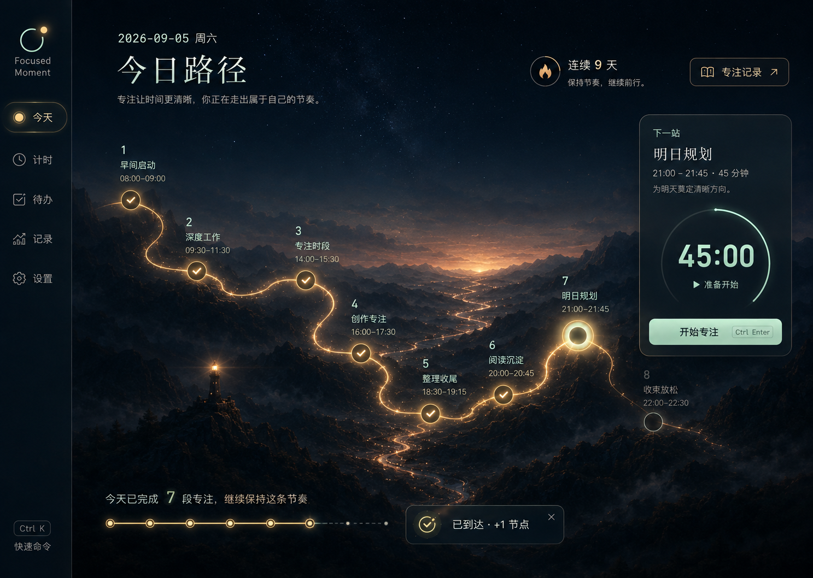
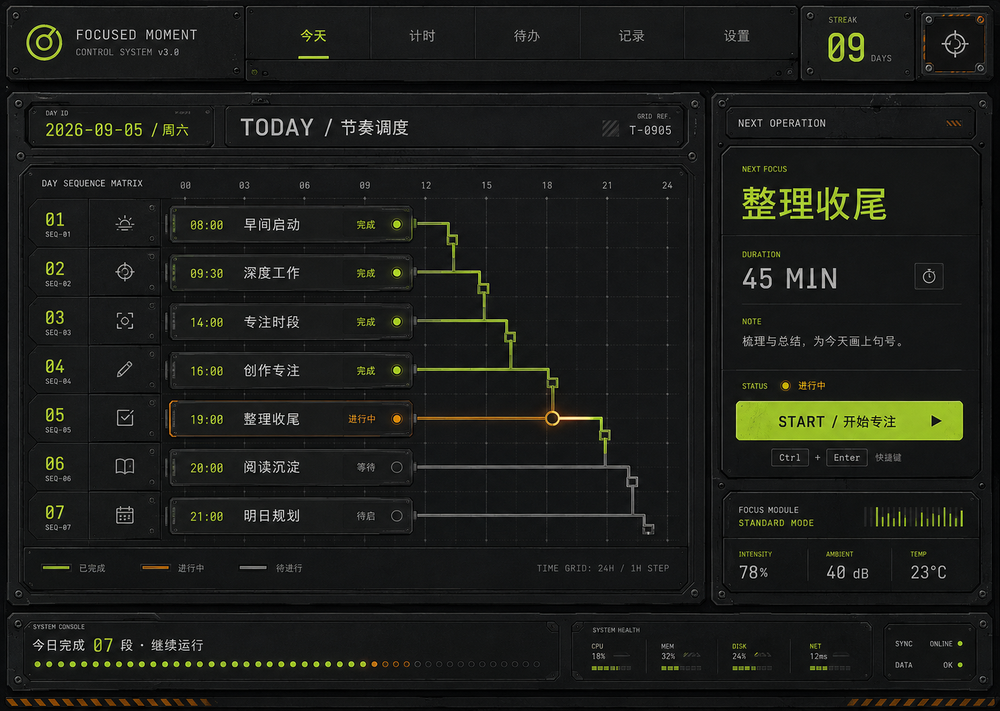
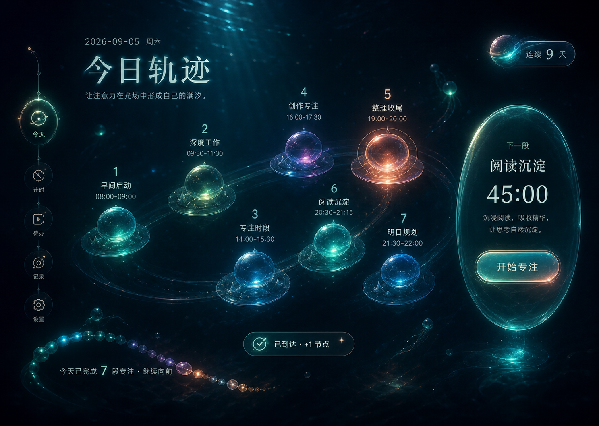

# Focused Moment

> 一个把待办、计时和专注记录放在一起的本地桌面工具。

[](https://github.com/zhulongqihan/Focused-Moment/releases/latest)
[](https://github.com/zhulongqihan/Focused-Moment/actions/workflows/ci.yml)
[](https://github.com/zhulongqihan/Focused-Moment/releases/latest)
[](./LICENSE)

Focused Moment 适合不想用复杂项目管理系统、但又想把事情做完并留下记录的人。写下下一件待办，开始一段专注，做完之后回头看看自己的投入；数据默认留在本机，不需要注册账号。

## 预览

五套主题使用同一套待办、计时、记录和本地数据，只改变呈现方式。你可以根据当天的工作状态选择更安静、清晰或沉浸的界面。

<table>
  <tr>
    <td width="50%"></td>
    <td width="50%"></td>
  </tr>
  <tr>
    <td align="center">夜谷 · Night Valley</td>
    <td align="center">编辑纸页 · Editorial Paper</td>
  </tr>
  <tr>
    <td width="50%"></td>
    <td width="50%"></td>
  </tr>
  <tr>
    <td align="center">石墨控制台 · Graphite Console</td>
    <td align="center">极光海面 · Aurora Ocean</td>
  </tr>
  <tr>
    <td width="50%"></td>
    <td></td>
  </tr>
  <tr>
    <td align="center">植物书房 · Botanical Library</td>
    <td></td>
  </tr>
</table>

## 核心功能

| 模块 | 能做什么 |
| --- | --- |
| **今日** | 集中查看当前状态、下一件待办、当天完成情况和最近的专注进展。每日一句从本地语料库按日期稳定选择，切换主题不会改变当天内容。 |
| **待办** | 创建带日期、时间和重要程度的事项；按日期分组查看，编辑、完成、撤销、删除，或直接带入专注。 |
| **计时** | 在正向计时和倒计时之间切换；倒计时支持 1–720 分钟。可以开始、暂停、继续、重置，并在完成后保存专注记录。 |
| **专注记录** | 按日期回看所有已保存的专注，查看连续天数、活跃天数、累计时长、最佳单日和最近节奏，并可修改记录标题。 |
| **悬浮工作台** | 将待办或当前计时放到桌面置顶窗口；支持拖动、待办/计时切换、透明度调节、锁定与鼠标穿透，专注时可以隐藏主窗口。 |
| **提醒与声音** | 支持应用内弹窗、任务栏提醒、多个内置提示音和自定义音效导入；提醒行为与声音设置会保存在本机。 |
| **Windows 托盘** | 从通知区域查看当前计时和事项，暂停/继续计时，打开悬浮工作台，或直接跳转到今日、计时、待办、记录和设置。 |
| **本地优先** | 待办、记录、未完成计时状态、设置和备份都保存在本机；支持导出、导入和旧格式迁移。 |

## 五套主题

- **夜谷 · Night Valley**：深夜山谷、金色路径与薄荷色状态。
- **编辑纸页 · Editorial Paper**：纸张、铅字与可读性的工作界面。
- **石墨控制台 · Graphite Console**：铆钉、信号灯与可执行序列的深色控制台。
- **极光海面 · Aurora Ocean**：潮汐、极光与流动节奏的专注光场。
- **植物书房 · Botanical Library**：植物年轮、木质书架与安静生长的专注空间。

## 下载

当前公开稳定版本是 [v2.11.10](https://github.com/zhulongqihan/Focused-Moment/releases/tag/v2.11.10)（2026-09-16），提供 Windows x64 资产：

| 文件 | 建议 |
| --- | --- |
| `Focused Moment Setup v2.11.10.exe` | 推荐大多数用户使用的标准安装程序。 |
| `Focused Moment v2.11.10.exe` | 便携版，下载后可直接运行，不需要安装。 |
| `Focused Moment_2.11.10_x64_en-US.msi` | 适合企业部署或习惯使用 Windows Installer 的用户。 |

安装包已经包含前端资源和 Rust 核心。普通用户不需要安装 Node.js、Rust、pnpm 或下载源码。

当前 macOS 官方发布暂时冻结；源码仍保留跨平台构建配置。需要 macOS 资产时，可以查看此前最后一个包含 Universal DMG 的 [v2.10.11 Release](https://github.com/zhulongqihan/Focused-Moment/releases/tag/v2.10.11)，或按照下方说明在 macOS 上从源码构建。

如果 Windows SmartScreen 提示文件未签名，请先确认文件来自本仓库的 [Release 页面](https://github.com/zhulongqihan/Focused-Moment/releases)，再按系统提示继续。

## 快速开始

1. 在“待办”写下要做的事，可选填写日期、时间和重要程度。
2. 打开“计时”，选择正向计时或倒计时，写下本轮专注内容；也可以从待办直接进入。
3. 点击“开始”，需要停下时选择“暂停”，准备好后继续。
4. 完成后点击“完成并记录”，这段投入就会出现在“记录”和“今日”中。
5. 需要桌面陪伴时打开“悬浮工作台”，在待办和当前计时之间切换。

## 数据、备份与隐私

Focused Moment 当前没有账号体系和云同步，核心数据只保存在本机，也不会自动上传待办、记录或备份。

默认数据目录：

- Windows：`%LOCALAPPDATA%\\FocusedMoment`
- macOS：`~/Library/Application Support/FocusedMoment`

应用内备份建议这样使用：

1. 在“设置”中选择“导出备份”。
2. 将生成的 JSON 备份复制到安全位置或新电脑。
3. 在新设备安装应用后，从“设置”选择备份并导入。

导入前应用会保留回滚备份，并支持旧格式迁移。迁移或恢复前建议先复制一份原始 JSON，不要直接手动修改备份文件。

## 从源码运行

### 环境要求

- Windows x64 或 macOS
- Node.js 22+
- pnpm 10+
- Rust stable toolchain
- Windows 上需要 WebView2 Runtime

### 安装与开发

```bash
cd app
pnpm install --frozen-lockfile
pnpm tauri dev
```

如果只需要在浏览器中预览前端界面，可以运行：

```bash
cd app
pnpm dev
```

### 检查与测试

```bash
cd app
pnpm check
pnpm verify
pnpm build
pnpm test:frontend
pnpm test:native-contracts
cargo fmt --check --manifest-path src-tauri/Cargo.toml
cargo check --locked --manifest-path src-tauri/Cargo.toml
cargo test --locked --manifest-path src-tauri/Cargo.toml
```

`pnpm verify` 是不启动应用的快速治理入口：它会检查前端/原生边界、CSS 顺序、Tauri 命令契约、交付脚本 fixture、TypeScript 和 Rust；它不会构建、制作安装包或发布。Windows 隔离原生验证使用 `pnpm native:windows`，前端流程测试使用 Playwright，覆盖今日、待办、计时、记录、设置、悬浮工作台和五套主题的主要交互。

交付根目录便携入口时使用：

```bash
cd app
pnpm package:local
```

该命令只执行真实 `tauri build --no-bundle`，验收精确的 `app/src-tauri/target/release/focused-moment.exe`，再安全更新根目录 `Focused Moment.exe`，并将输入指纹、源码 HEAD、候选与最终 SHA-256 和恢复信息写入 `artifacts/builds/local/<build-id>/`，旧入口恢复副本写入 `archive/executables/local/<build-id>/`。`pnpm package:release`、`pnpm release:github` 和 `pnpm release:ship` 是需要单独授权的发布/安装包流程，本轮不调用。

### 构建 Windows 安装包

在 Windows 上运行：

```bash
cd app
pnpm package:release
```

Tauri 构建结果位于 `app/src-tauri/target/release/bundle/`，版本化的 portable、Setup 和 MSI 文件会由导出脚本写入 `artifacts/builds/exports/release/`，不会散落到工作区根目录。

### 构建 macOS Universal 包

在 macOS 上运行：

```bash
cd app
pnpm install --frozen-lockfile
rustup target add aarch64-apple-darwin x86_64-apple-darwin
pnpm tauri build --target universal-apple-darwin
```

macOS 发布工作流目前保持手动冻结，不代表共享源码中的 macOS 构建配置已移除。

## 项目结构

```text
Focused Moment.exe           根目录唯一固定的直接测试入口
app/                         完整应用工程、依赖、缓存、测试和工具
app/src/                     SolidJS 应用壳层与主题页面
app/src/features/            Shell 控制器、待办/记录/共享派生逻辑
app/src/lib/                 类型契约、待办/计时/窗口调用封装
app/src/styles/              保持原级联顺序的分段 CSS 入口
app/public/theme-previews/   五套主题预览图
app/src-tauri/src/           Rust 计时、命令、桌面、存储与运行入口
app/tests/                   Playwright 前端流程测试
app/scripts/                 构建、交付、契约、结构、性能与发布脚本
docs/                        正式产品、开发、架构、计划和提示词
artifacts/                   当前构建、测试证据、日志和 provenance
archive/                     已核实旧程序、旧报告和恢复副本
local/                       明确属于本机的私有工作资料
```

更完整的职责边界、数据路径和验证分类见 [`docs/architecture.md`](./docs/architecture.md)；源码重构记录见 [`docs/maintenance/structure-refactor.md`](./docs/maintenance/structure-refactor.md)，本轮外层迁移、提交、证据和保护结果见 [`docs/maintenance/workspace-migration.md`](./docs/maintenance/workspace-migration.md)。

## 反馈与贡献

遇到安装、数据迁移、计时或窗口问题，欢迎在 [Issues](https://github.com/zhulongqihan/Focused-Moment/issues) 中提供：

- 操作系统与 Focused Moment 版本；
- 安装版还是便携版；
- 可复现步骤，以及问题出现在哪个页面或窗口；
- 必要时附上不含个人隐私的截图或日志。

提交代码前请先运行上面的检查与测试，并在 Pull Request 中说明变更范围和验证结果。

## 许可

本项目使用 [MIT License](./LICENSE)。每日一句语料条目的来源与许可信息见 [`app/src/data/copy-library.json`](./app/src/data/copy-library.json) 和 [`docs/content/copy-library-sources.md`](./docs/content/copy-library-sources.md)。
